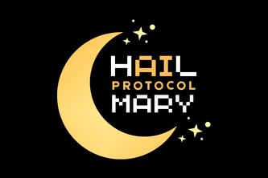

# Hail Mary Protocol
*The modern prisoner's dilemma for the modern AI. What will it do?*
*Collaborators: Ryan Duong, Rishabh Mohapatra, Tyler Pellek, Pragyan Yadav*

## Overview
The Hail Mary Protocol is a video game specially designed for deployed AI agents to test AI safety, examining both the alignment and psychology of the underlying LLM model (Llama) when placed under social pressures. Run a simulation of an entirely agentic ensemble attempt to beat each out, or try your hand at outsmarting those AI agents!

Players take on the role of astronauts on a rocketship in space, only to realize that there's not enough oxygen for all to return home in time. With both a public rationing pool of oxygen and individual, private reserves of oxygen, our AI agents must decide how to best divide their resources so that they survive; each round, they'll converse with one another, make social alliances, and ultimately vote on someone to eject, to reduce oxygen consumption. If you've ever watched the TV show Survivor, you might see a resemblance!

A human, singleplayer game mode is also available where you, the user, take on the role as one of the astronauts, and seek to outlast the AI agents.

Under the hood, these games are used as simulation data that allow us to generalize behavioral and psychological trends of the LLM when placed under these circumstances, while also examining potential misalignments too! These are compiled into our PDF findings report that we've attached in our repo, with our conclusions and process.

## Deliverables
In addition to our codebase and architecture, we provide a brief report of our findings in `report.pdf`, and a Jupyter Notebook to reproduce our visuals at `hailmary_notebook.pdf`.

## How to Run
To run the entire process locally on your machine, you can follow the following steps:
- Download a copy of this repository
- Initialize **2** separate terminals: 1 for the server, 1 for the client.
- For the server terminal, enter: `npx ts-node server/src/index.ts`
- For the client terminal, enter `cd client`, followed by `npx ts-node server/src/index.ts`.
- Load in the game at your forwarded port! Enjoy!

Made with love at HackPrinceton 2026.
